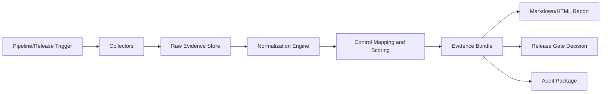

# Secure SDLC Evidence Collector

## 1. Visao do produto

O **Secure SDLC Evidence Collector** e uma ferramenta para **coletar, normalizar, correlacionar e empacotar evidencias de seguranca ao longo do ciclo de desenvolvimento de software**.

Em vez de responder apenas "quais vulnerabilidades foram encontradas?", o produto responde uma pergunta mais madura:

**"Quais evidencias comprovam que esta release seguiu um processo minimo de desenvolvimento seguro?"**

O foco do projeto nao e substituir scanners, pipelines ou plataformas de compliance. O foco e **provar, com rastreabilidade e contexto, que as praticas esperadas de Secure SDLC realmente ocorreram**.

---

## 2. Problema que o produto resolve

Muitas organizacoes afirmam que praticam Secure SDLC, mas as evidencias ficam espalhadas em varias ferramentas e sem um modelo unico de consolidacao:

- logs de pipeline
- resultados de SAST, SCA, DAST e secrets scan
- aprovacoes de PR
- threat models
- SBOMs
- resultados de testes
- tickets e excecoes
- aprovacoes de release
- evidencias de rollback
- assinaturas e atestacoes de artefatos

Na pratica, isso gera cinco dores recorrentes:

1. **Auditoria lenta e manual**: a equipe precisa garimpar evidencias em varias fontes para justificar uma release.
2. **Baixa rastreabilidade**: existe scanner e processo, mas nao existe encadeamento claro entre commit, pipeline, release e controles atendidos.
3. **Governanca fraca de release**: a decisao de liberar para producao depende de "feeling" ou checklist informal.
4. **Maturidade dificil de medir**: a empresa ate roda controles, mas nao consegue provar cobertura, consistencia e gaps.
5. **Compliance burocratico**: SSDF, SAMM ou controles internos viram exercicio documental em vez de evidencias operacionais.

---

## 3. Tese do produto

O Secure SDLC Evidence Collector transforma sinais tecnicos dispersos em um **evidence bundle padronizado**, auditavel e orientado a release.

Esse bundle deve permitir responder, de forma explicavel:

- qual release esta sendo avaliada
- quais fontes produziram evidencias
- quais evidencias sao brutas e quais sao derivadas
- quais controles foram satisfeitos, parcialmente satisfeitos ou nao satisfeitos
- quais gaps impedem uma liberacao segura
- quais excecoes foram aprovadas e por quem
- qual nivel de confianca existe sobre cada afirmacao

O produto nao deve dizer "esta release e segura". Ele deve dizer:

- **quais praticas minimas foram comprovadas**
- **quais nao foram comprovadas**
- **quais dependem de excecao**
- **qual a confianca da avaliacao**

---

## 4. Usuarios-alvo

### Primarios

- **AppSec Lead / AppSec Engineer**
  Quer provar maturidade de Secure SDLC, reduzir coleta manual e identificar gaps por release ou time.

- **DevSecOps / Platform Engineer**
  Quer automatizar coleta de evidencias no pipeline e reduzir friccao operacional.

- **Release Manager / Engineering Manager**
  Quer um gate objetivo para decidir se uma release esta pronta do ponto de vista de seguranca e governanca.

### Secundarios

- **Auditoria interna / GRC**
  Quer pacote de evidencias padronizado, com lineage e consistencia.

- **Arquitetura / Lideranca de engenharia**
  Quer medir maturidade por produto, squad, repositorio ou unidade de negocio.

- **Clientes enterprise / Due diligence**
  Quer provas de processo seguro sem depender de apresentacoes subjetivas.

---

## 5. Perguntas de negocio que o produto deve responder

O projeto fica realmente forte quando responde perguntas de alto valor:

- Esta release possui o conjunto minimo de evidencias obrigatorias?
- Quais controles de Secure SDLC foram atendidos e por quais artefatos?
- Quais evidencias estao faltando, expiradas, fracas ou inconsistentes?
- Existe SBOM gerado para esta release? Ele foi associado ao artefato correto?
- Houve code review suficiente e por revisores elegiveis?
- Existe evidencias de SAST, SCA, secrets scan e testes para o commit liberado?
- Existe threat model ou justificativa de nao aplicabilidade?
- Existe aprovacao formal de release e plano de rollback?
- Existe assinatura, atestacao ou integridade do artefato publicado?
- Qual o score de cobertura de evidencias por release, repositorio ou time?

---

## 6. Proposta de valor

O produto entrega valor em quatro frentes:

1. **Release readiness orientado a evidencias**
   A release deixa de depender de checklist informal e passa a depender de um pacote tecnico rastreavel.

2. **Compliance pragmatico**
   Em vez de produzir documentos paralelos, a ferramenta reaproveita evidencias que ja nasceram no fluxo de engenharia.

3. **Maturidade de programa AppSec**
   Permite medir cobertura, consistencia, excecoes e lacunas de Secure SDLC por produto ou time.

4. **Auditoria e due diligence mais rapidas**
   Reduz o tempo de coleta manual e melhora a confianca na evidencia apresentada.

---

## 7. Casos de uso prioritarios

### Caso de uso 1: gate de release

Ao final do pipeline, o collector consolida evidencias da build/release e produz:

- bundle tecnico
- score de cobertura
- gaps obrigatorios
- status da release: `ready`, `conditional` ou `not_ready`

### Caso de uso 2: pacote de auditoria

A equipe exporta um pacote unico com:

- evidencias brutas e metadados
- avaliacoes por controle
- excecoes aprovadas
- resumo executivo e tecnico

### Caso de uso 3: medicao de maturidade

Ao longo do tempo, a plataforma mostra:

- percentual de releases com evidencias completas
- controles mais frequentemente ausentes
- ferramentas/fontes com menor qualidade de evidencias
- evolucao da maturidade por produto ou repositorio

---

## 8. Escopo funcional do produto

O produto deve ser organizado em cinco capacidades centrais.

### 8.1 Ingestao de evidencias

Coletar evidencias a partir de:

- arquivos locais
- artefatos de pipeline
- APIs de SCM/CI/CD
- documentos ou attestations fornecidos manualmente

### 8.2 Normalizacao

Converter saidas heterogeneas em um formato canonico.

Exemplos:

- SARIF, JSON, XML, JUnit, CycloneDX, SPDX
- metadados de PR, reviewers, checks e merge
- links ou referencias a threat model, rollback plan e release approval

### 8.3 Correlacao e avaliacao

Relacionar evidencias com:

- aplicacao
- repositorio
- branch
- commit
- pull request
- pipeline run
- build
- release
- controle de seguranca

### 8.4 Scoring e gaps

Gerar:

- score de cobertura de evidencias
- score de confianca da avaliacao
- gaps obrigatorios e recomendados
- bloqueios para release

### 8.5 Exportacao e empacotamento

Gerar:

- evidence bundle em JSON
- relatorio tecnico em Markdown
- relatorio HTML para consumo humano
- pacote pronto para auditoria

---

## 9. Modelo conceitual de evidencias

O coracao do projeto nao e o collector em si, e o **modelo de evidencias**.

O produto precisa distinguir claramente tres camadas:

1. **Raw Evidence**
   Artefato bruto vindo da fonte original.

2. **Normalized Evidence**
   Evidencia convertida para um contrato canonico.

3. **Derived Assertion**
   Conclusao calculada com base nas evidencias normalizadas.

Exemplo:

- um arquivo `semgrep.sarif` e uma raw evidence
- um registro `evidence_type=sast_scan, tool=semgrep, status=completed` e normalized evidence
- a conclusao `controle SSDF PW.7 atendido parcialmente` e uma derived assertion

### Entidades principais

- **Application**
  Produto ou servico avaliado.

- **Release Candidate**
  Unidade principal de avaliacao. Relaciona commit, pipeline, build e release.

- **Evidence Source**
  Origem da evidencia: GitHub, GitLab, Trivy, Semgrep, Snyk, Jira, artefato local etc.

- **Raw Evidence**
  Arquivo, payload ou metadado coletado sem reinterpretacao semantica completa.

- **Normalized Evidence**
  Registro canonico com tipo, status, timestamps, lineage, sujeito avaliado e confianca.

- **Control Definition**
  Controle esperado, por exemplo SSDF, SAMM ou controle interno.

- **Control Evaluation**
  Resultado da avaliacao do controle para uma release.

- **Exception / Waiver**
  Excecao formal, aprovada, com escopo, justificativa, expiracao e aprovador.

- **Evidence Bundle**
  Pacote final gerado para consumo tecnico, auditoria ou gate.

### Campos minimos por evidencia normalizada

- `evidence_id`
- `evidence_type`
- `source_system`
- `producer`
- `subject_type`
- `subject_ref`
- `release_id`
- `commit_sha`
- `collected_at`
- `generated_at`
- `status`
- `confidence`
- `artifact_path` ou `artifact_uri`
- `integrity_hash`
- `metadata`

### Campos minimos por avaliacao de controle

- `control_id`
- `framework`
- `control_name`
- `evaluation_status`
- `severity_if_missing`
- `evidence_refs`
- `exception_refs`
- `rationale`
- `evaluated_at`

---

## 10. Exemplo de bundle mais maduro

```json
{
  "bundle_version": "1.0.0",
  "bundle_id": "bundle-2026-04-10-payments-api",
  "application": {
    "name": "payments-api",
    "repository": "acme/payments-api",
    "environment": "production"
  },
  "release": {
    "release_id": "2026.04.10",
    "commit_sha": "abc123",
    "branch": "main",
    "pipeline_run_id": "gha-93821",
    "build_id": "build-2041",
    "artifact_digest": "sha256:1234567890abcdef"
  },
  "evidence": [
    {
      "evidence_id": "ev-001",
      "evidence_type": "sast_scan",
      "source_system": "github_actions",
      "producer": "semgrep",
      "subject_type": "repository",
      "subject_ref": "acme/payments-api",
      "status": "passed",
      "confidence": "high",
      "generated_at": "2026-04-10T12:10:00Z",
      "collected_at": "2026-04-10T12:12:00Z",
      "artifact_path": "artifacts/semgrep.sarif",
      "integrity_hash": "sha256:aaa"
    },
    {
      "evidence_id": "ev-002",
      "evidence_type": "code_review",
      "source_system": "github",
      "producer": "pull_request",
      "subject_type": "pull_request",
      "subject_ref": "PR-184",
      "status": "passed",
      "confidence": "high",
      "metadata": {
        "reviewers_required": 2,
        "reviewers_approved": 2,
        "last_approval_after_last_commit": true
      }
    },
    {
      "evidence_id": "ev-003",
      "evidence_type": "sbom",
      "source_system": "github_actions",
      "producer": "cyclonedx",
      "subject_type": "artifact",
      "subject_ref": "payments-api:2026.04.10",
      "status": "generated",
      "confidence": "high",
      "artifact_path": "artifacts/sbom.cdx.json"
    }
  ],
  "control_evaluations": [
    {
      "control_id": "SSDF-PS.3",
      "framework": "NIST_SSDF",
      "control_name": "Protect code from unauthorized access and tampering",
      "evaluation_status": "met",
      "severity_if_missing": "high",
      "evidence_refs": ["ev-002", "ev-003"],
      "rationale": "Pull request reviewed and artifact inventory generated"
    },
    {
      "control_id": "ORG-REL-ROLLBACK",
      "framework": "ORG_INTERNAL",
      "control_name": "Rollback plan exists and was approved",
      "evaluation_status": "missing",
      "severity_if_missing": "critical",
      "evidence_refs": [],
      "rationale": "No rollback evidence associated with this release"
    }
  ],
  "summary": {
    "evidence_coverage_score": 72,
    "confidence_score": 84,
    "release_status": "conditional",
    "missing_critical_evidence": [
      "rollback_plan",
      "artifact_signature"
    ]
  }
}
```

---

## 11. Estrategia de controle e scoring

O scoring nao deve ser simplista nem enganar o usuario.

### Regras recomendadas

- Nem toda evidencia tem o mesmo peso.
- Evidencias obrigatorias devem ter peso maior que evidencias recomendadas.
- Alguns gaps devem bloquear release mesmo com score alto.
- Score deve vir acompanhado de explicacao.

### Modelo sugerido

- **Evidence coverage score**: mede cobertura de evidencias esperadas.
- **Confidence score**: mede quao confiaveis e completas sao as evidencias coletadas.
- **Release status**:
  - `ready`: evidencias obrigatorias atendidas
  - `conditional`: faltas nao criticas ou release dependente de excecao aprovada
  - `not_ready`: faltam evidencias criticas ou ha inconsistencias graves

### Regra importante

O produto nao deve afirmar "compliance automatico". Ele deve afirmar:

- quais controles possuem evidencias suficientes
- quais controles dependem de interpretacao humana
- quais controles permanecem sem prova

---

## 12. Mapeamento de frameworks

O MVP deve nascer com foco em **framework mapping enxuto e evolutivo**.

### Frameworks iniciais recomendados

- **NIST SSDF** como framework principal
- **Controles internos de release readiness**
- **OWASP SAMM** como mapeamento secundario futuro

### Estrategia

- cada tipo de evidencia deve poder mapear para um ou mais controles
- cada controle deve declarar evidencias obrigatorias, recomendadas e alternativas
- a regra de avaliacao deve ser explicavel, nunca uma caixa-preta

---

## 13. Fluxo operacional do produto



### Fluxo detalhado

1. O pipeline termina uma build ou uma release.
2. O collector recebe contexto de execucao: aplicacao, commit, PR, run, artifact digest e release id.
3. Os collectors consultam fontes configuradas ou leem artefatos locais.
4. As evidencias brutas sao armazenadas e referenciadas.
5. O motor de normalizacao converte cada evidencia para o contrato canonico.
6. O motor de avaliacao relaciona evidencias com controles e calcula score/gaps.
7. O exporter gera bundle, relatorio tecnico e resultado consumivel por humanos ou automacao.
8. O sistema marca a release como `ready`, `conditional` ou `not_ready`.

---

## 14. Escopo do MVP

O MVP precisa ser pequeno o bastante para sair do papel, mas forte o bastante para demonstrar valor senior.

### Entradas suportadas no MVP

- arquivos locais
- artefatos do GitHub Actions
- metadados de pull request do GitHub
- attestations manuais em JSON/YAML para evidencias ainda nao automatizadas

### Tipos de evidencia obrigatorios no MVP

- SAST
- SCA
- secrets scan
- SBOM
- test result
- code review / PR approval
- threat model link ou attestation
- release approval
- rollback plan attestation
- artifact signature ou attestation equivalente

### Saidas obrigatorias do MVP

- `bundle.json`
- `report.md`
- `summary.html`
- resultado final de release status

### Integracoes iniciais recomendadas

- GitHub
- GitHub Actions
- Semgrep
- Trivy ou Snyk
- CycloneDX
- JUnit/pytest reports

---

## 15. Nao objetivos do MVP

Para manter foco e qualidade, o MVP **nao** deve tentar fazer tudo.

### Fora do MVP

- multi-tenant SaaS completo
- dashboard analitico avancado
- suporte amplo a GitLab, Azure DevOps e Jira logo de inicio
- workflow completo de exceptions em interface rica
- engine complexa de policy-as-code multi-framework
- integracoes bidirecionais com ITSM/GRC

---

## 16. Arquitetura recomendada para o MVP

### Abordagem

Um MVP **CLI-first com API simples opcional** e o caminho mais seguro.

Isso permite:

- foco no modelo de dominio
- facilidade de execucao em pipeline
- menos sobrecarga de UI no inicio
- demonstracao forte de engenharia e AppSec

### Modulos sugeridos

- `collectors/`
  Conectores e adaptadores por fonte

- `parsers/`
  Leitura de formatos brutos

- `normalizers/`
  Conversao para o schema canonico

- `controls/`
  Regras de avaliacao e mapeamento

- `scoring/`
  Calculo de score e status

- `bundles/`
  Geracao do pacote final

- `exporters/`
  Markdown, HTML, JSON

- `api/` ou `cli/`
  Interfaces de execucao

---

## 17. Requisitos funcionais do MVP

- Permitir informar `application`, `release_id`, `commit_sha` e contexto de pipeline.
- Ingerir arquivos SARIF, SBOM CycloneDX/SPDX, resultados de teste e attestations manuais.
- Coletar metadados de PR e approvals no GitHub.
- Normalizar todas as evidencias para um schema unico.
- Avaliar um conjunto inicial de controles de Secure SDLC.
- Calcular score de cobertura e status de release.
- Gerar bundle JSON e relatorio tecnico em Markdown/HTML.
- Explicar gaps, evidencias ausentes e dependencias de excecao.

---

## 18. Requisitos nao funcionais

- **Auditabilidade**: toda afirmacao deve apontar para as evidencias usadas.
- **Rastreabilidade**: commit, PR, pipeline, build e release devem permanecer encadeados.
- **Explicabilidade**: score e status nao podem ser caixas-pretas.
- **Extensibilidade**: novos collectors e novos controles devem ser plugaveis.
- **Seguranca**: nao expor segredos, minimizar permissoes e registrar lineage sem vazar dados sensiveis.
- **Reprodutibilidade**: a mesma entrada deve produzir a mesma avaliacao.

---

## 19. Consideracoes de seguranca do proprio produto

Como o projeto manipula dados sensiveis de engenharia, ele precisa nascer com postura segura:

- nao logar tokens, segredos, URLs assinadas ou artefatos sensiveis
- validar formatos e tamanhos de arquivos ingeridos
- usar hash de integridade para artefatos coletados
- guardar provenance de quem produziu e quem coletou a evidencia
- tratar attestations manuais como evidencias de menor confianca
- permitir politica de least privilege para acesso a APIs externas

---

## 20. Criterios de aceite do MVP

O MVP sera considerado bom quando conseguir demonstrar o seguinte:

1. Recebe um contexto real de release e gera um `bundle.json` consistente.
2. Consegue ingerir ao menos cinco tipos de evidencia diferentes.
3. Consegue correlacionar evidencias com commit, PR e release.
4. Consegue mapear evidencias para um conjunto inicial de controles.
5. Explica claramente o que esta faltando e por que a release nao esta pronta.
6. Gera relatorio tecnico legivel e bundle reutilizavel por auditoria.
7. Funciona localmente e em GitHub Actions.
8. Possui testes automatizados para schema, collectors e motor de avaliacao.

---

## 21. KPIs do produto

Quando o projeto evoluir, ele deve ser medido por:

- tempo para gerar pacote de auditoria por release
- percentual de releases com evidencias obrigatorias completas
- quantidade media de gaps criticos por repositorio
- percentual de evidencias coletadas automaticamente vs manualmente
- tempo para identificar evidencia faltante antes do deploy

---

## 22. Roadmap apos o MVP

### Fase 2

- suporte adicional a GitLab e Azure DevOps
- workflow formal de excecoes
- mais exporters e relatorios
- mais controles internos e SAMM

### Fase 3

- dashboard historico
- tendencias por time/produto
- comparativos por release
- APIs para integracao com GRC e auditoria

### Fase 4

- policy-as-code para gates
- suporte a provenance e attestation mais avancados
- analytics de maturidade de programa AppSec

---

## 23. Por que este projeto e forte para portfolio

Esse projeto comunica um perfil de engenharia e seguranca acima do nivel "scanner wrapper".

Ele demonstra:

- entendimento de Secure SDLC como sistema operacional de engenharia
- maturidade em governanca de release
- capacidade de modelar evidencias e nao apenas findings
- foco em rastreabilidade, explicabilidade e auditoria
- visao senior/staff de AppSec e DevSecOps

Em resumo: e um produto que prova processo, nao apenas detecta falha.
